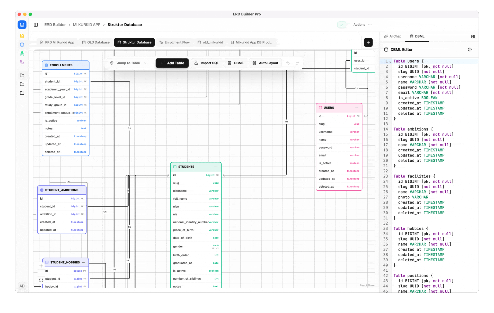

<div align="center">
  <picture>
    <source media="(prefers-color-scheme: dark)" srcset="public/img/ERD-Builder-Pro-Dark.svg" />
    <source media="(prefers-color-scheme: light)" srcset="public/img/ERD-Builder-Pro-Light.svg" />
    
  </picture>
</div>

<div align="center">

[](https://hub.docker.com/r/bekenweb/erd-builder-pro)
[](https://hub.docker.com/r/bekenweb/erd-builder-pro)
[](https://hub.docker.com/r/bekenweb/erd-builder-pro)

</div>

**ERD Builder Pro** is a database design and documentation tool for developers. Build ERDs, flowcharts, notes, and drawings — all in one workspace.

<div align="center">
  
</div>

> [!WARNING]
> **ERD Builder Pro** is under active development and not yet stable — features and config may still change. Give the repo a Star ⭐ and Watch 👀 it to get notified the moment a release lands.

## 🚀 Key Features

- **🎨 Visual Workspace**: ERD diagrams (XYFlow), flowcharts, free-hand drawing (Excalidraw), and rich-text notes (TipTap).
- **📝 DBML Editor**: Write and edit DBML (Database Markup Language) with syntax highlighting, live bidirectional sync with ERD, and auto-generated column/relationship definitions.
- **📤 Export**: Generate SQL DDL (PostgreSQL, MySQL), export as images or PDF.
- **🔗 Remote Database Connection**: Connect to remote PostgreSQL, MySQL, or SQLite databases — browse tables, inspect schemas, and import structures into your ERD.
- **📁 Project Management**: Organize assets into projects with soft-delete trash system.
- **🤖 AI Assistant**: Context-aware chat per view — generate SQL, seed data, summarize notes, create flowcharts. Streaming responses with auto-apply.
- **🔐 Security**: Supabase authentication, Cloudflare R2 storage, rate limiting, Helmet middleware.

## 🛠️ Tech Stack

- **Frontend**: [React 18](https://reactjs.org/) + [Vite 6](https://vite.dev/) + [Tailwind CSS v4](https://tailwindcss.com/)
- **UI System**: [Shadcn UI](https://ui.shadcn.com/) + [Radix UI](https://www.radix-ui.com/) + [Lucide Icons](https://lucide.dev/)
- **Canvas Engines**: [XYFlow](https://xyflow.com/) + [Excalidraw](https://excalidraw.com/)
- **Content Editor**: [TipTap](https://tiptap.dev/) (Rich Text Engine)
- **Backend Architecture**: [Express.js](https://expressjs.com/) + [Edge Functions Support](https://vercel.com/docs/functions/edge-functions)
- **Infrastructure**: [Supabase](https://supabase.com/) (DB/Auth) + [Cloudflare R2](https://www.cloudflare.com/developer-platform/r2/) (Storage)

---

## 🏗️ Getting Started

### 🚀 Quick Install (Recommended)

The CLI app is the fastest way to get started — no Docker, no Supabase, no config:

```bash
npm install -g erdbpro
erdbpro
```

Opens at `http://localhost:3101`. Data stored locally in `~/.erdbpro/`. Login with `admin@local.dev` / `admin123`.

A desktop app is also available on the [releases page](https://github.com/hadziqmtqn/erd-builder-pro/releases) (macOS `.dmg`, Windows `.msi`, Linux `.deb`). Note: the desktop app is not yet code-signed — macOS and Windows may show a security warning on first launch.

### MCP (Desktop, CLI, and Web) — Experimental

> [!WARNING]
> MCP support is **Experimental**. Tool names, inputs, and capability limits may change. Review write-tool calls before approving them.

Use `erdbpro mcp` for CLI data or `erdbpro mcp --desktop` for Desktop data. The Desktop command runs its bundled MCP backend directly and does not launch a second GUI application. Supabase Web App deployments can additionally expose an OAuth-protected Streamable HTTP endpoint by setting `MCP_PUBLIC_URL` and enabling the Supabase OAuth 2.1 server.

The local tool set can read DB Client data and apply confirmed Note/history operations. The public Web MCP surface is separate and read-only: it exposes Web workspace documents and history, while DB Client, `production_db`, credentials, SQL execution, filesystem access, and writes are not registered.

In Desktop and CLI, open **Settings → MCP Integration** to copy a ready-to-use local `stdio` configuration for JetBrains AI, VS Code, Codex, Hermes Agent, or a generic MCP client. See the [full MCP setup guide](https://docs.erdbuilderpro.com/configuration/mcp) for client and Web MCP configuration details.

### 🐳 Docker

```bash
docker pull bekenweb/erd-builder-pro:latest

docker run -d --name erd-builder-pro -p 3000:3000 \
  --env-file .env \
  bekenweb/erd-builder-pro:latest
```

### 🧪 Testing

The project uses [Vitest](https://vitest.dev/) for unit testing with a focus on core logic — SQL parsers, schema diff engine, auto-layout algorithms, and code generators.

**Test commands**:
```bash
npm test            # Run all tests once
npm run test:watch  # Run in watch mode during development
```

**Test structure**:
```
src/lib/__tests__/
├── sqlParser.test.ts          # SQL DDL parser (17 tests)
├── schema-diff.test.ts        # Schema comparison engine (8 tests)
├── autoLayoutERD.test.ts      # ERD auto-layout algorithm (12 tests)
├── autoLayoutFlowchart.test.ts # Flowchart auto-layout algorithm (12 tests)
├── sql-generator.test.ts      # Code generation for 7 dialects (39 tests)
└── sql-generator-all.test.ts  # Bulk export & FK extraction (19 tests)
```

**Coverage areas**: SQL DDL parsing across PostgreSQL/MySQL/SQLite dialects, schema diff & merge resolution, directed-graph auto-layout (BFS layering, cycle detection, diamond decision branching), and multi-dialect code generation (MySQL, PostgreSQL, Laravel, TypeScript, Prisma, Zod).

---

## 🤝 Sponsors

<div align="center">
  <a href="https://www.idcloudhost.com" target="_blank">
    
  </a>
  &nbsp;&nbsp;&nbsp;
  <a href="https://doktainer.com" target="_blank">
    
  </a>
  &nbsp;&nbsp;&nbsp;
  <a href="https://sumopod.com" target="_blank">
    
  </a>
</div>

| Sponsor | Support |
|---------|---------|
| [**IDCloudhost**](https://www.idcloudhost.com) | Virtual machine infrastructure for deployment and cloud hosting. |
| [**Doktainer**](https://doktainer.com) | App template platform with Docker panel for streamlined container management. |
| [**SumoPod**](https://sumopod.com) | Seamless container and application purchasing solutions for businesses of all sizes. |

---

## 💖 Support

<a href="https://trakteer.id/khadziq_muttaqin/tip" target="_blank"></a>

---

## 📄 License

This project is licensed under the **[PolyForm Noncommercial License 1.0.0](./LICENSE)**. 

### 🚫 Non-Commercial Use Only
The software is free to use, modify, and distribute for **non-commercial purposes only**. Any use for revenue-generating activities or within for-profit organizations is strictly prohibited under these terms.

### 💼 Commercial Licensing
If you wish to use ERD Builder Pro for commercial purposes, business operations, or as part of a paid service, you must obtain a separate commercial license. Please contact the author for further information.

---

<p align="center">Built for Architects & Developers ❤️</p>
